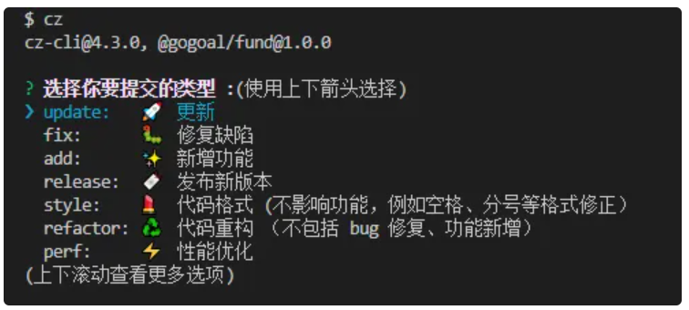

# 前端工程化

## 概述

本文介绍了前端项目中代码格式校验工具，以及 git 提交时代码校验和提交信息校验的工具的介绍和配置。

在概述中将简单介绍各个工具的功能以及配置文件的位置。

### 代码校验和格式化

实现的功能是：

1. 检测代码是否满足规则，对不满足规则的进行标红
2. 保存代码的时候自动进行格式化

代码格式化需要两个工具搭配代码编辑器完成

| 工具名称 | 功能                                                                                            | 配置                  |
| -------- | ----------------------------------------------------------------------------------------------- | --------------------- |
| eslint   | 校验代码、格式化代码。具体的校验规则定义在配置文件里                                            | .eslintrc.js          |
| prettier | 格式化代码（eslint 格式化能力不够）                                                             | .prettierrc           |
| vscode   | 默认代码风格，如默认缩进 4 个空格，字体大小等保存代码的时候执行调用 eslint、prettier 进行格式化 | .vscode/settings.json |

### git 提交的代码和提交信息校验

实现的功能是：

1. 校验暂存区的代码格式是否满足定义的规则
2. 校验提交信息是否满足定义的规则

暂存区的代码校验规则是 eslint 定义的规则，只是需要拿到暂存区代码的钩子

提交信息校验只做了提交类型校验，只能包含指定类型：release、build、update、docs、add、fix、perf、refactor、revert、style、test、merge

| 工具名称    | 功能                                                                                                                                                                                                                                                   | 配置                                                                                                                                                                                                                  |
| ----------- | ------------------------------------------------------------------------------------------------------------------------------------------------------------------------------------------------------------------------------------------------------ | --------------------------------------------------------------------------------------------------------------------------------------------------------------------------------------------------------------------- |
| husky       | 提供 git 钩子，主要用到了两个钩子，pre-commit，commit-msgpre-commit 是提交前拿到暂存区的代码的钩子，在这里会做一次代码校验，处理这个钩子用到的工具是 lint-stagedcommit-msg 是提交信息的钩子，在这里会校验提交信息，处理这个钩子用到的工具是 commitlint | .husky/pre-commit.husky/commit-msg                                                                                                                                                                                    |
| lint-staged | 校验暂存区代码                                                                                                                                                                                                                                         | package.json`{  ...  "lint-staged": {        "*.js, *.ts, *.vue, *.jsx, *.tsx": [            "eslint --fix",            "prettier"        ],        "*.md, *.less, *.scss": [            "prettier"        ]    }, }` |
| commitlint  | 校验提交信息                                                                                                                                                                                                                                           | commitlint.config.jk                                                                                                                                                                                                  |

### 交互式提交工具

提供了一个终端交互式提交工具，采用 commitizen，配合适配器进行提问

全局安装 commitizen，npm install -g commitizen，就可以使用 cz 命令在终端进行选项式提交


配置的话，需要在package.json中指定适配器位置

```json
{
  ...
  "config": {
    "commitizen": {
        "path": "./cz.cjs"
    }
  }
}
```

cz.js文件里面包含了提问的信息，可以根据实际情况修改，也可以用现有开源的适配器，如cz-git。

## 前端工程化概述

前端工程化是指：在企业级的前端项目开发中，把前端开发所需的工具、技术、流程、经验等进行规范化、标准化。

就像是往一个杂物间存东西，当东西比较少，随便乱丢都找得到，但是当东西数量多起来，找起来就不容易了。这个时候如果有个柜子之类的工具就可以更好分类，以便查找的时候更快速。

前端工程化在项目逐渐壮大起来的时候是有必要的，随意散乱的结构和布局会使得维护困难，因此我们需要一些方法和工具帮助我们实现前端工程化。

## 代码规范

代码规范是前端工程化的一个方面，代码规范可以帮助我们统一团队代码风格，降低阅读难度，同时也可以借助工具提前发现部分错误，并修复。

代码规范主要解决的问题是：保证编码风格一致，使项目易于维护，因为团队内任何人都可以快速理解并修改。

这里我们针对两方面进行规范：

> 一是代码格式规范，如代码缩进统一（一个tab或者两个空格）；
>
> 二是`git`提交规范，进行代码检查以及提交信息规范，例如提交信息`fix: 修复xxx，xxx`

**初始化一键代码校验、格式化、git提交检验、辅助提交工具**


```plain
yarn add -D eslint eslint-plugin-vue prettier eslint-config-prettier eslint-plugin-prettier husky lint-staged commitlint commitizen editor temp word-wrap find-config
```


### 1. 代码格式规范


代码格式规范问题，我们通过 `ESLint` + `Prettier` + `VSCode 配置` 配合进行处理，最终达到了在保存代码时，自动规范化代码格式的目的。

`Eslint`是什么？它和`Prettier`有什么关系？一开始，我以为他俩干的是同一件事——格式化代码。

其实可以简单这样理解，二者配合的目的就是让我们的代码满足指定的格式。

`Eslint`具备的作用是：

- 检查语法
- 找到问题
- 修复问题

我们使用`eslint`来实现语法检查，举个例子，变量定义后未使用会报错。

对于格式化的功能，我们需要借助`prettier`辅助，将`prettier`集成到`eslint`上，可以完成一些`eslint`无法修复的格式，比如，当某一行代码超过长度规则限制，`eslint`只会给一个`warning`，而`prettier`会格式化它。详细可参考：https://github.com/prettier/prettier-eslint/issues/101

**注意：编辑器需要安装eslint和prettier插件**

编辑器安装`eslint`插件可以对不满足规则的语句**波浪线标红**，`prettier`插件可以配合`vscode`设置实现保存代码时**自动格式化**

##### 1.1 代码检查工具`Eslint`

```plain
yarn add -D eslint eslint-plugin-vue

npx eslint --init
```

```
init` 命令会自动生成 `.eslintrc.js
```

我们直接CV现有的配置（后续根据需要调整）：

```plain
module.exports = {
    root: true,
    ignorePatterns: ['node_moduls/*'],
    env: {
        browser: true,
        es2021: true,
        node: true,
        commonjs: true
    },
    extends: ['eslint:recommended', 'plugin:vue/essential', 'prettier'],
    overrides: [],
    parserOptions: {
        ecmaVersion: 'latest',
        sourceType: 'module'
    },
    plugins: ['vue', 'prettier'],
    rules: {
        'linebreak-style': ['error', 'unix'],
        'no-multiple-empty-lines': [1, { max: 2 }], //空行最多不能超过2行
        'vue/multi-word-component-names': 'off' //vue组件名去掉多单词限制
    }
}
```

###### 1.1.1 `eslint`规则

`.eslintrc.js` 文件`rule`规则参考：(注意，我们在`eslint`中控制语法层面的，样式风格交给`prettier`)

[所有规则的说明](https://link.zhihu.com/?target=https%3A//cn.eslint.org/docs/rules/)，[中文详解（每条规则）](http://www.verydoc.net/eslint/00003312.html)

| rule                                                         | 介绍                                                         |
| ------------------------------------------------------------ | ------------------------------------------------------------ |
| [ for-direction](https://cn.eslint.org/docs/rules/for-direction) | 强制 “for” 循环中更新子句的计数器朝着正确的方向移动          |
| [getter-return](https://cn.eslint.org/docs/rules/getter-return) | 强制 getter 函数中出现 `return` 语句                         |
| [no-async-promise-executor](https://cn.eslint.org/docs/rules/no-async-promise-executor) | 禁止使用异步函数作为 Promise executor                        |
| [no-await-in-loop](https://cn.eslint.org/docs/rules/no-await-in-loop) | 禁止在循环中出现 `await`                                     |
| [no-compare-neg-zero](https://cn.eslint.org/docs/rules/no-compare-neg-zero) | 禁止与 -0 进行比较                                           |
| [no-cond-assign](https://cn.eslint.org/docs/rules/no-cond-assign) | 禁止条件表达式中出现赋值操作符                               |
| [no-console](https://cn.eslint.org/docs/rules/no-console)    | 禁用 `console`                                               |
| [no-constant-condition](https://cn.eslint.org/docs/rules/no-constant-condition) | 禁止在条件中使用常量表达式                                   |
| [no-control-regex](https://cn.eslint.org/docs/rules/no-control-regex) | 禁止在正则表达式中使用控制字符                               |
| [no-debugger](https://cn.eslint.org/docs/rules/no-debugger)  | 禁用 `debugger`                                              |
| [no-dupe-args](https://cn.eslint.org/docs/rules/no-dupe-args) | 禁止 `function` 定义中出现重名参数                           |
| [no-dupe-keys](https://cn.eslint.org/docs/rules/no-dupe-keys) | 禁止对象字面量中出现重复的 key                               |
| [no-duplicate-case](https://cn.eslint.org/docs/rules/no-duplicate-case) | 禁止出现重复的 case 标签                                     |
| [no-empty](https://cn.eslint.org/docs/rules/no-empty)        | 禁止出现空语句块                                             |
| [no-empty-character-class](https://cn.eslint.org/docs/rules/no-empty-character-class) | 禁止在正则表达式中使用空字符集                               |
| [no-ex-assign](https://cn.eslint.org/docs/rules/no-ex-assign) | 禁止对 `catch` 子句的参数重新赋值                            |
| [no-extra-boolean-cast](https://cn.eslint.org/docs/rules/no-extra-boolean-cast) | 禁止不必要的布尔转换                                         |
| [no-extra-parens](https://cn.eslint.org/docs/rules/no-extra-parens) | 禁止不必要的括号                                             |
| [no-extra-semi](https://cn.eslint.org/docs/rules/no-extra-semi) | 禁止不必要的分号                                             |
| [no-func-assign](https://cn.eslint.org/docs/rules/no-func-assign) | 禁止对 `function` 声明重新赋值                               |
| [no-inner-declarations](https://cn.eslint.org/docs/rules/no-inner-declarations) | 禁止在嵌套的块中出现变量声明或 `function` 声明               |
| [no-invalid-regexp](https://cn.eslint.org/docs/rules/no-invalid-regexp) | 禁止 `RegExp` 构造函数中存在无效的正则表达式字符串           |
| [no-irregular-whitespace](https://cn.eslint.org/docs/rules/no-irregular-whitespace) | 禁止不规则的空白                                             |
| [no-misleading-character-class](https://cn.eslint.org/docs/rules/no-misleading-character-class) | 不允许在字符类语法中出现由多个代码点组成的字符               |
| [no-obj-calls](https://cn.eslint.org/docs/rules/no-obj-calls) | 禁止把全局对象作为函数调用                                   |
| [no-prototype-builtins](https://cn.eslint.org/docs/rules/no-prototype-builtins) | 禁止直接调用 `Object.prototypes` 的内置属性                  |
| [no-regex-spaces](https://cn.eslint.org/docs/rules/no-regex-spaces) | 禁止正则表达式字面量中出现多个空格                           |
| [no-sparse-arrays](https://cn.eslint.org/docs/rules/no-sparse-arrays) | 禁用稀疏数组                                                 |
| [no-template-curly-in-string](https://cn.eslint.org/docs/rules/no-template-curly-in-string) | 禁止在常规字符串中出现模板字面量占位符语法                   |
| [no-unexpected-multiline](https://cn.eslint.org/docs/rules/no-unexpected-multiline) | 禁止出现令人困惑的多行表达式                                 |
| [no-unreachable](https://cn.eslint.org/docs/rules/no-unreachable) | 禁止在 `return`、`throw`、`continue` 和 `break` 语句之后出现不可达代码 |
| [no-unsafe-finally](https://cn.eslint.org/docs/rules/no-unsafe-finally) | 禁止在 `finally` 语句块中出现控制流语句                      |
| [no-unsafe-negation](https://cn.eslint.org/docs/rules/no-unsafe-negation) | 禁止对关系运算符的左操作数使用否定操作符                     |
| [require-atomic-updates](https://cn.eslint.org/docs/rules/require-atomic-updates) | 禁止由于 `await` 或 `yield`的使用而可能导致出现竞态条件的赋值 |
| [use-isnan](https://cn.eslint.org/docs/rules/use-isnan)      | 要求使用 `isNaN()` 检查 `NaN`                                |
| [valid-typeof](https://cn.eslint.org/docs/rules/valid-typeof) | 强制 `typeof` 表达式与有效的字符串进行比较                   |

###### 1.1.2 `eslint`扩展

在`.eslintrc.js`中`rules`用来配置`ESLint`的规则，具体配置规则的方法请参考官网 [如何配置规则](https://link.zhihu.com/?target=https%3A//cn.eslint.org/docs/user-guide/configuring%23configuring-rules) 以及 [所有规则的说明](https://link.zhihu.com/?target=https%3A//cn.eslint.org/docs/rules/)，这里不作详细介绍，同样为了方便使用，`ESLint`使用`extends`配置来一次性生效一整套规则。

`ESint`支持**三种类型**的扩展：

- `eslint:` 开头的 `ESLint`官方扩展
  包括 `eslint:recommended` 和 `eslint:all`，其中 `eslint:recommended`是推荐的一套规则，`eslint:all` 是 `ESLint`中的所有规则，不推荐使用，因为可能随时被 `ESLint`更改。
- 共享的扩展
  通过 `npm` 包提供一套共享的配置，包名前缀必须为`eslint-config-`，`extends`属性值可以省略包名的前缀`eslint-config-`。 `package.json` 中 `eslint-config-standard` 这个包提供的一套规则。
- 插件中提供的扩展
  我们使用的`eslint-plugin-prettier` 插件，还有`eslint-plugin-vue`插件，他们针对某一类具体的文件进行格式化。

`vue`[插件配置](https://eslint.vuejs.org/user-guide/#usage)

###### 1.1.3 rules、extends、plugins

参考文章：[Eslint中plugins和extends的区别](https://juejin.cn/post/6859291468138774535)、[深入浅出 Eslint，告别 Lint 恐惧症](https://juejin.cn/post/7136458949322080292#heading-8)

**rules：**

安装 lint 工具的基本目的，就是对代码进行各种限定，统一风格。因为每个人、每个团队追求的风格不同，所以工具也会提供各种配置，帮助限定代码

**extends：**

对于不同项目，如果希望使用相同的 rules，直接复制粘贴显然不是一个好方法，一是 rules 太多，配置文件会显得很乱，二是无法同步更新。

推荐使用的方法是把所需的 rules 抽离成一个 npm 包，需要的时候再通过 extends 引用。而且对于这些抽离出来的包，有着统一的命名规范

plugins与rules结合是eslint基础能力，extends可以看做是去集成一个个配置方案的最佳实践

允许 extends 多个模块，如果规则冲突，位置靠后的包将覆盖前面的。**rules 中的规则相同，并且优先级恒定高于 extends**

原先还需要自己一条条选择，这样就可以直接把官方配置好的最佳实践直接拿来用。如果碰到和自己风格或者规范有冲突的规则，那直接在rules中重新定义就可以了，毕竟冲突的规则往往都没有多少。

extends扩展的规则包含了一套plugin和rules，但是和默认的eslint规则冲突的时候，eslint的相应规则会失效，不会检查这条规则。

**plugins：**

虽然官方提供了很多规则，但是总有覆盖不到的情况。这时候可以使用 plugin 定义**自己的规则（如Vue、React）**

声明了 Plugin 时仅表示我们引入了该规则对应的集合，并不代表会立即启动。需要我们**手动在** `**rules**` **中去声明**对应插件的规则。

plugins只是加载了插件，可以理解赋予了eslint解析规则的检查能力，真正开启这个规则的检查能力还是要通过**rules配置**。（一个插件库里面往往有几十个新规则，并不是每一个规则都需要开启的，这是时候就要根据自己的需求来配置相关检查规则）

##### 1.2 代码风格工具prettier

###### 1.2.1 安装和配置

安装工具：

```
yarn add -D prettier eslint-config-prettier eslint-plugin-prettier
```

创建 `.prettierrc`

```json
{
    "useTabs": false,
    "tabWidth": 4,
    "printWidth": 80,
    "singleQuote": true,
    "trailingComma": "none",
    "semi": false,
    "endOfLine": "lf"
}
```

###### 1.2.2 设置忽略文件

可以设置`.prettierignore`忽略文件

```plain
/dist/*
.local
.output.js
/node_modules/**

**/*.svg
**/*.sh
*.lock
package-*.json

/public/*
**/iconSvg/*
**/third_party/*
/docs/*
/.history/*
```

###### 1.2.3 解决冲突

由于`ESLint`定义了一些`js`的代码格式化的约束，导致其与Prettier存在一些冲突。如：

- `ESLint`默认语句结尾不加分号，Prettier默认语句结尾加分号；
- `ESLint`默认强制使用单引号，Prettier默认使用双引号；
- `ESLint`默认句末减少不必要的逗号，Prettier默认尽可能多使用逗号等等

```
eslint-config-prettier`和`eslint-plugin-prettier
```

- `eslint-config-prettier`：禁用掉了一些不必要的以及和 `Prettier` 相冲突的 `ESLint` 规则；
- `eslint-plugin-prettier`：将`prettier` 作为`ESLint`的规则来使用，相当于代码不符合 Prettier 的标准时，会报一个`ESLint`错误，同时也可以通过`eslint --fix`来进行格式化；这样就相当于将`Prettier`整合进了`ESLint`中；

使用extends扩展，将会禁掉Eslint的标红报错，只使用prettier的格式化

使用plugin插件，不会禁用Eslint的规则，会有标红的功能，个人比较喜欢plugin的效果

```plain
module.exports = {
	extends: ['eslint:recommended', 'plugin:vue/essential', 'prettier'],	//注意，prettier写到最后，避免被其他插件覆盖
	plugin: ['vue', 'prettier']
}
```

##### 1.3 `vscode`插件

我们团队大部分用的是vscode编辑器，如果使用其他编辑器，使用[EditorConfig](https://editorconfig-specification.readthedocs.io/)进行配置，可以参考[前端editorconfig使用详解](https://www.jianshu.com/p/c727c3c945bb)

`vscode`编辑器安装`eslint`插件可以在保存的时候进行代码检查。

在项目根目录新建`.vscode`文件夹，在文件夹下新建`settings.json`

编辑`settings.json`:

```json
{
    "editor.codeActionsOnSave": {
        "source.fixAll.eslint": true //设置代码保存时需要做的工作——启用保存时自动修复,默认只支持.js文件
    },
    "editor.formatOnSave": true,
    "files.eol": "\n", //设置编辑器行尾以LF格式结尾，以匹配git远程代码库
    "editor.defaultFormatter": "esbenp.prettier-vscode", //主要是因为vscode lint规则与project lint规则不一致，保存的时候按A规则format，编辑、提交时又按B规则校验，规则不一致则来回format。
    "prettier.tabWidth": 4,
    "files.trimTrailingWhitespace": true,
    "files.trimFinalNewlines": true
}
```

参考链接：[ESlint与Prettier配置指南](https://juejin.cn/post/7050127881371910152)、[Prettier配置指南](https://juejin.cn/post/6938687606687432740)

### 2. git提交规范

我们使用`husky`检测`git`钩子，`lint-staged`规范化暂存区代码，`commitlint`规范化提交信息。

##### 2.1 git钩子介绍

Git 有很多的 hooks, 让我们在不同的阶段,对代码进行不同的操作,控制提交到仓库的代码的规范性,和准确性, 以下只是几个常用的钩子

| git钩子      | 描述                              |
| ------------ | --------------------------------- |
| `pre-commit` | 判断提交的代码是否符合规范        |
| `commit-msg` | 判断 commit 信息是否符合规范      |
| `pre-push`   | 执行测试,避免对以前的内容造成影响 |

##### 2.2 工具介绍

- `husky`：操作git钩子的工具
- `lint-staged`：本地暂存代码检查工具
- `commitlint`：提交信息校验工具
- `commitizen`：辅助提交信息 ，**全局安装**后可以使用`cz`命令，选项式提交`git`

##### 2.3 安装和配置

###### 2.3.1 husky

[官方文档](https://typicode.github.io/husky/#/)

[官方文档](https://typicode.github.io/husky/#/)

```plain
yarn add -D husky lint-staged
```

在`package.json`中添加脚本

```plain
npm set-script prepare "husky install"
```

初始化`husky`，将`git hooks`钩子交由，`husky`执行。会在根目录创建 `.husky` 文件夹

```plain
yarn prepare
```

###### 2.3.2 lint-staged

检测`pre-commit`钩子，执行 `npx lint-staged` 指令

```plain
npx husky add .husky/pre-commit "npx lint-staged"
```

[lint-staged配置](https://github.com/okonet/lint-staged#Configuration)

可以在根目录创建 `.lintstagedrc.json`文件控制检查和操作方式


```plain
{
    "*.{js,jsx,ts,tsx}": ["prettier --write", "eslint  --fix"],
    "*.{css,json,md,less,scss}": ["prettier --write"]
}
```

也可以在`package.json`中配置：

```plain
{
    "lint-staged": {
      "*.{js,jsx,ts,tsx}": ["prettier --write", "eslint  --fix"],
      "*.{css,json,md,less,scss}": ["prettier --write"]
    }
}
```

###### 2.3.3 commitlint

[官网](https://commitlint.js.org/#/)

```plain
yarn add -D commitlint
npx husky add .husky/commit-msg 'npx --no-install commitlint --edit "$1"'
```

添加配置文件`commitlint.config.js`：

```json
// commitlint.config.js
/** @type {import('cz-git').UserConfig} */

module.exports = {
    rules: {
        // @see: https://commitlint.js.org/#/reference-rules
        // 配置规则：
        //     每个配置是一个个键值对，键值是array类型：
        //         第一个参数表示：重要等级，0表示关闭规则，1表示warning，2表示error
        //         第二个参数表示：应用与否，always | nerver
        //         第三个参数表示：配置规则的值
        // commit message的结构如下：
        //     <type>[optional scope]: <description>
        //     [optional body]
        //     [optional footer(s)]
        // 简短描述(subject)
        // 详细描述(body)
        'body-leading-blank': [1, 'always'], // body开头空行
        'body-max-line-length': [2, 'always', 100], // body最大内容长度
        'footer-leading-blank': [1, 'always'], // footer开头空行
        'footer-max-line-length': [2, 'always', 100], // footer最大内容长度
        'header-max-length': [2, 'always', 100], // header最大长度
        // subject单词格式
        'subject-case': [
            2,
            'never',
            ['sentence-case', 'start-case', 'pascal-case', 'upper-case'],
        ],
        'subject-empty': [2, 'never'], // subject是否为空
        'subject-full-stop': [2, 'never', '.'], // subject中止符
        'type-case': [2, 'always', 'lower-case'], // type单词格式
        'type-empty': [2, 'never'], // type是否为空
        // type可选值
        'type-enum': [
            2,
            'always',
            [
                'release',
                'build',
                'update',
                'docs',
                'add',
                'fix',
                'perf',
                'refactor',
                'revert',
                'style',
                'test',
            ],
        ],
    },
    prompt: {
        alias: {
            fd: 'docs: :memo: 文档更新',
            uv: 'release: :bookmark: update version',
        },
        messages: {
            type: '选择你要提交的类型 :',
            scope: '选择一个提交范围（可选）:',
            customScope: '请输入自定义的提交范围 :',
            subject: '填写简短精炼的变更描述 :\n',
            body: '填写更加详细的变更描述（可选）。使用 "|" 换行 :\n',
            breaking: '列举非兼容性重大的变更（可选）。使用 "|" 换行 :\n',
            footerPrefixsSelect: '选择关联issue前缀（可选）:',
            customFooterPrefixs: '输入自定义issue前缀 :',
            footer: '列举关联issue (可选) 例如: #31, #I3244 :\n',
            confirmCommit: '是否提交或修改commit ?',
        },
        types: [
            {
                value: 'add',
                name: 'add:      ✨  新增功能',
                emoji: ':sparkles:',
            },
            {
                value: 'update',
                name: 'update:   🚀  更新',
                emoji: ':rocket:',
            },
            {
                value: 'fix',
                name: 'fix:      🐛  修复缺陷',
                emoji: ':bug:',
            },
            {
                value: 'release',
                name: 'release:  🔖  发布新版本',
                emoji: ':bookmark:',
            },
            {
                value: 'style',
                name: 'style:    💄  代码格式 (不影响功能，例如空格、分号等格式修正）',
                emoji: ':lipstick:',
            },
            {
                value: 'refactor',
                name: 'refactor: ♻️   代码重构 （不包括 bug 修复、功能新增）',
                emoji: ':recycle:',
            },
            {
                value: 'perf',
                name: 'perf:     ⚡️  性能优化',
                emoji: ':zap:',
            },
            {
                value: 'test',
                name: 'test:     ✅  添加疏漏测试或已有测试改动',
                emoji: ':white_check_mark:',
            },
            {
                value: 'build',
                name: 'build:    📦️  构建相关 （构建流程、外部依赖变更（如升级 npm 包、修改 webpack 配置等）',
                emoji: ':package:',
            },
            {
                value: 'docs',
                name: 'docs:     📝  文档更新',
                emoji: ':memo:',
            },
            {
                value: 'revert',
                name: 'revert:   ⏪️  回滚 commit',
                emoji: ':rewind:',
            },
        ],
        useEmoji: true, // 是否开启 commit message 带有 Emoji 字符。
        emojiAlign: 'center', // 设置 Emoji 字符 的 位于头部位置
        themeColorCode: '', // 设置提示查询器主题颜色, cyan青色
        scopes: [], // 自定义选择 模块范围 命令行显示信息
        allowCustomScopes: true, // 是否在选择 模块范围 显示自定义选项(custom)
        allowEmptyScopes: true, // 是否在选择 模块范围 显示为空选项(empty)
        customScopesAlign: 'bottom', // 设置 选择范围 中 为空选项(empty) 和 自定义选项(custom) 的 位置
        customScopesAlias: 'custom', // 自定义 选择范围 中 自定义选项(custom) 在命令行中显示的 名称
        emptyScopesAlias: 'empty', // 自定义 选择范围 中 为空选项(empty) 在命令行中显示的 名称
        upperCaseSubject: false, // 是否自动将简短描述(subject)第一个字符进行大写处理
        markBreakingChangeMode: false, // 添加额外的问题重大变更(BREAKING CHANGES)提问，询问是否需要添加 "!" 标识于
        allowBreakingChanges: ['feat', 'fix'], // 允许出现 重大变更(BREAKING CHANGES)的特定 type
        breaklineNumber: 100, // 详细描述(body)和重大变更(BREAKING CHANGES)中根据字符超过该数值自动换行
        breaklineChar: '|', // 详细描述(body)和重大变更(BREAKING CHANGES)中换行字符
        skipQuestions: ['scope', 'body', 'breaking', 'footerPrefix', 'footer'], // 自定义选择指定的问题不显示
        // 自定义选择issue前缀
        issuePrefixs: [
            // 如果使用 gitee 作为开发管理
            { value: 'link', name: 'link:     链接 ISSUES 进行中' },
            { value: 'closed', name: 'closed:   标记 ISSUES 已完成' },
        ],
        customIssuePrefixsAlign: 'top', // 设置 选择 issue 前缀 中 跳过选项(skip) 和 自定义选项(custom) 的 位置
        emptyIssuePrefixsAlias: 'skip', // 自定义 选择 issue 前缀 中 跳过选项(skip) 在命令行中显示的 名称
        customIssuePrefixsAlias: 'custom', // 自定义 选择 issue 前缀 中 自定义选项(custom) 在命令行中显示的 名称
        allowCustomIssuePrefixs: true, // 是否在选择 ISSUE 前缀 显示自定义选项(custom)
        allowEmptyIssuePrefixs: true, // 是否在选择 ISSUE 前缀 显示为跳过选项(skip)
        confirmColorize: true, // 确定提交中模板 commit message 是否着色
        maxHeaderLength: Infinity, // 定义commit message中的 header 长度, 给予在命令行中的校验信息
        maxSubjectLength: Infinity, // 定义commit message中的 subject 长度, 给予在命令行中的校验信息
        minSubjectLength: 0, // 定义commit message中的 subject 长度, 给予在命令行中的校验信息
        scopeOverrides: undefined, // 自定义选择了特定类型后 覆盖模块范围 命令行显示信息
        defaultBody: '', // 在 详细描述 中是否使用显示默认值
        defaultIssues: '', // 在 输入ISSUE 中是否使用显示默认值
        defaultScope: '', // 如果 defaultScope 与在选择范围列表项中的 value 相匹配就会进行星标置顶操作。
        defaultSubject: '', // 在 简短描述 中是否使用显示默认值
    },
}
```

| 类型     | 描述                                                   |
| -------- | ------------------------------------------------------ |
| release  | 发布新版                                               |
| build    | 编译相关的修改，例如发布版本、对项目构建或者依赖的改动 |
| update   | 更新                                                   |
| docs     | 文档修改                                               |
| add      | 新特性、新功能                                         |
| fix      | 修改bug                                                |
| perf     | 优化相关，比如提升性能、体验                           |
| refactor | 代码重构                                               |
| revert   | 回滚到上一个版本                                       |
| style    | 代码格式修改, 注意不是 css 修改                        |
| test     | 测试用例修改                                           |

###### 2.3.4 commitizen

什么是commitizen：基于Node.js的 `git commit` 命令行工具，辅助生成标准化规范化的 commit message。

什么是适配器：适配器是为commitizen提供提示性交互的工具，提问功能就是适配器里面的

**注意：要使用cz命令，必须全局安装commitizen**

**注意：要使用cz命令，必须全局安装commitizen**

**注意：要使用cz命令，必须全局安装commitizen**

```plain
npm i -g commitizen
```

**方式一:** 在 **package.json** 下 config.commitizen 下添加自定义配置，但过量的配置项会导致 package.json 臃肿，不介绍了。

**方式二: (推荐)  使用适配器**

与 [commitlint](https://github.com/conventional-changelog/commitlint) 进行联动给予校验信息**，所以可以编写于 [commitlint](https://github.com/conventional-changelog/commitlint#config) 配置文件之中。例如: ([⇒ 配置模板](https://cz-git.qbb.sh/zh/config/))

cz-git适配器的效果挺好的，我们由于有特殊的提问需求，于是没采用cz-git适配器，但是在我们自己的适配器里面，实现了类似的功能。

在`commitlint.config.js`中添加prompt对象：

```plain
// commitlint.config.js

module.exports = {
    prompt: {
        alias: {
            fd: 'docs: :memo: 文档更新',
            uv: 'release: :bookmark: update version',
        },
        messages: {
            type: '选择你要提交的类型 :',
            scope: '选择一个提交范围（可选）:',
            customScope: '请输入自定义的提交范围 :',
            subject: '填写简短精炼的变更描述 :\n',
            body: '填写更加详细的变更描述（可选）。使用 "|" 换行 :\n',
            breaking: '列举非兼容性重大的变更（可选）。使用 "|" 换行 :\n',
            footerPrefixsSelect: '选择关联issue前缀（可选）:',
            customFooterPrefixs: '输入自定义issue前缀 :',
            footer: '列举关联issue (可选) 例如: #31, #I3244 :\n',
            confirmCommit: '是否提交或修改commit ?',
        },
        types: [
            {
                value: 'add',
                name: 'add:      ✨  新增功能',
                emoji: ':sparkles:',
            },
            {
                value: 'update',
                name: 'update:   🚀  更新',
                emoji: ':rocket:',
            },
            {
                value: 'fix',
                name: 'fix:      🐛  修复缺陷',
                emoji: ':bug:',
            },
            {
                value: 'release',
                name: 'release:  🔖  发布新版本',
                emoji: ':bookmark:',
            },
            {
                value: 'style',
                name: 'style:    💄  代码格式 (不影响功能，例如空格、分号等格式修正）',
                emoji: ':lipstick:',
            },
            {
                value: 'refactor',
                name: 'refactor: ♻️   代码重构 （不包括 bug 修复、功能新增）',
                emoji: ':recycle:',
            },
            {
                value: 'perf',
                name: 'perf:     ⚡️  性能优化',
                emoji: ':zap:',
            },
            {
                value: 'test',
                name: 'test:     ✅  添加疏漏测试或已有测试改动',
                emoji: ':white_check_mark:',
            },
            {
                value: 'build',
                name: 'build:    📦️  构建相关 （构建流程、外部依赖变更（如升级 npm 包、修改 webpack 配置等）',
                emoji: ':package:',
            },
            {
                value: 'docs',
                name: 'docs:     📝  文档更新',
                emoji: ':memo:',
            },
            {
                value: 'revert',
                name: 'revert:   ⏪️  回滚 commit',
                emoji: ':rewind:',
            },
        ],
        useEmoji: true, // 是否开启 commit message 带有 Emoji 字符。
        emojiAlign: 'center', // 设置 Emoji 字符 的 位于头部位置
        themeColorCode: '', // 设置提示查询器主题颜色, cyan青色
        scopes: [], // 自定义选择 模块范围 命令行显示信息
        allowCustomScopes: true, // 是否在选择 模块范围 显示自定义选项(custom)
        allowEmptyScopes: true, // 是否在选择 模块范围 显示为空选项(empty)
        customScopesAlign: 'bottom', // 设置 选择范围 中 为空选项(empty) 和 自定义选项(custom) 的 位置
        customScopesAlias: 'custom', // 自定义 选择范围 中 自定义选项(custom) 在命令行中显示的 名称
        emptyScopesAlias: 'empty', // 自定义 选择范围 中 为空选项(empty) 在命令行中显示的 名称
        upperCaseSubject: false, // 是否自动将简短描述(subject)第一个字符进行大写处理
        markBreakingChangeMode: false, // 添加额外的问题重大变更(BREAKING CHANGES)提问，询问是否需要添加 "!" 标识于
        allowBreakingChanges: ['feat', 'fix'], // 允许出现 重大变更(BREAKING CHANGES)的特定 type
        breaklineNumber: 100, // 详细描述(body)和重大变更(BREAKING CHANGES)中根据字符超过该数值自动换行
        breaklineChar: '|', // 详细描述(body)和重大变更(BREAKING CHANGES)中换行字符
        skipQuestions: ['scope', 'body', 'breaking', 'footerPrefix', 'footer'], // 自定义选择指定的问题不显示
        // 自定义选择issue前缀
        issuePrefixs: [
            // 如果使用 gitee 作为开发管理
            { value: 'link', name: 'link:     链接 ISSUES 进行中' },
            { value: 'closed', name: 'closed:   标记 ISSUES 已完成' },
        ],
        customIssuePrefixsAlign: 'top', // 设置 选择 issue 前缀 中 跳过选项(skip) 和 自定义选项(custom) 的 位置
        emptyIssuePrefixsAlias: 'skip', // 自定义 选择 issue 前缀 中 跳过选项(skip) 在命令行中显示的 名称
        customIssuePrefixsAlias: 'custom', // 自定义 选择 issue 前缀 中 自定义选项(custom) 在命令行中显示的 名称
        allowCustomIssuePrefixs: true, // 是否在选择 ISSUE 前缀 显示自定义选项(custom)
        allowEmptyIssuePrefixs: true, // 是否在选择 ISSUE 前缀 显示为跳过选项(skip)
        confirmColorize: true, // 确定提交中模板 commit message 是否着色
        maxHeaderLength: Infinity, // 定义commit message中的 header 长度, 给予在命令行中的校验信息
        maxSubjectLength: Infinity, // 定义commit message中的 subject 长度, 给予在命令行中的校验信息
        minSubjectLength: 0, // 定义commit message中的 subject 长度, 给予在命令行中的校验信息
        scopeOverrides: undefined, // 自定义选择了特定类型后 覆盖模块范围 命令行显示信息
        defaultBody: '', // 在 详细描述 中是否使用显示默认值
        defaultIssues: '', // 在 输入ISSUE 中是否使用显示默认值
        defaultScope: '', // 如果 defaultScope 与在选择范围列表项中的 value 相匹配就会进行星标置顶操作。
        defaultSubject: '', // 在 简短描述 中是否使用显示默认值
    },
}
```

###### 2.3.5 编写adaptor

参考：[cz-git](https://github.com/Zhengqbbb/cz-git)、[commitizen](https://github.com/commitizen)/[cz-cli](https://github.com/commitizen/cz-cli)、[cz-customizable](https://github.com/leoforfree/cz-customizable)、[Inquirer.js](https://github.com/SBoudrias/Inquirer.js)

修改整合了`cz-customizable`的代码：

先安装依赖：

```plain
yarn add -D editor temp word-wrap find-config
```

```
cz_customizable.js
```

```plain
// cz_customizable.js
// 依赖：editor temp word-wrap lodash find-config
// yarn add -D editor temp word-wrap lodash find-config

/* eslint-disable global-require */
// Inspired by: https://github.com/commitizen/cz-conventional-changelog and https://github.com/commitizen/cz-cli

const editor = require('editor')
const temp = require('temp').track()
const fs = require('fs')
const _ = require('lodash')
const wrap = require('word-wrap')
const findConfig = require('find-config')
const path = require('path')

const log = console
const readConfigFile = (CZ_CONFIG_NAME = 'commitlint.config.js') => {
    // First try to find the .cz-config.js config file
    // It seems like find-config still locates config files in the home directory despite of the home:false prop.
    const czConfig = findConfig.require(CZ_CONFIG_NAME, { home: false })

    if (czConfig?.prompt) {
        return czConfig.prompt
    }

    // fallback to locating it using the config block in the nearest package.json
    let pkg = findConfig('package.json', { home: false })

    if (pkg) {
        const pkgDir = path.dirname(pkg)
        pkg = require(pkg)
        if (
            pkg.config &&
            pkg.config['cz-customizable'] &&
            pkg.config['cz-customizable'].config
        ) {
            // resolve relative to discovered package.json
            const pkgPath = path.resolve(
                pkgDir,
                pkg.config['cz-customizable'].config
            )
            log.info(
                '>>> Using cz-customizable config specified in your package.json: ',
                pkgPath
            )
            return require(pkgPath)
        }
    }

    /* istanbul ignore next */
    log.error(
        'Unable to find a configuration file. Please refer to documentation to learn how to set up: https://github.com/leonardoanalista/cz-customizable#steps "'
    )
    return null
}

const defaultSubjectSeparator = ': '
const defaultMaxLineWidth = 100
const defaultBreaklineChar = '|'

const isNotWip = (answers) => answers.type.toLowerCase() !== 'wip'

const isValidateTicketNo = (value, config) => {
    if (!value) {
        return !config.isTicketNumberRequired
    }
    if (!config.ticketNumberRegExp) {
        return true
    }
    const reg = new RegExp(config.ticketNumberRegExp)
    if (value.replace(reg, '') !== '') {
        return false
    }
    return true
}

const getPreparedCommit = (context) => {
    let message = null

    // eslint-disable-next-line no-undef
    let preparedCommit = getPreviousCommit()

    if (preparedCommit) {
        preparedCommit = preparedCommit
            .replace(/^#.*/gm, '')
            .replace(/^\s*[\r\n]/gm, '')
            .replace(/[\r\n]$/, '')
            .split(/\r\n|\r|\n/)

        if (preparedCommit.length && preparedCommit[0]) {
            if (context === 'subject') [message] = preparedCommit
            else if (context === 'body' && preparedCommit.length > 1) {
                preparedCommit.shift()
                message = preparedCommit.join('|')
            }
        }
    }

    return message
}
const addTicketNumber = (ticketNumber, config) => {
    if (!ticketNumber) {
        return ''
    }

    if (config.ticketNumberPrefix) {
        return `${config.ticketNumberPrefix + ticketNumber.trim()} `
    }

    return `${ticketNumber.trim()} `
}

const addScope = (scope, config) => {
    const separator = _.get(config, 'subjectSeparator', defaultSubjectSeparator)

    if (!scope) return separator // it could be type === WIP. So there is no scope

    return `(${scope.trim()})${separator}`
}

const addSubject = (subject) => _.trim(subject)

const addType = (type, config) => {
    const prefix = _.get(config, 'typePrefix', '')
    const suffix = _.get(config, 'typeSuffix', '')

    return _.trim(`${prefix}${type}${suffix}`)
}

const addBreaklinesIfNeeded = (value, breaklineChar = defaultBreaklineChar) =>
    value.split(breaklineChar).join('\n').valueOf()

const escapeSpecialChars = (result) => {
    const specialChars = ['`', '"', '\\$', '!', '<', '>', '&']
    let newResult = result

    specialChars.forEach((item) => {
        // If user types `feat: "string"`, the commit preview should show `feat: \"string\"`.
        // Don't worry. The git log will be `feat: "string"`
        newResult = newResult.replace(new RegExp(item, 'g'), `\\${item}`)
    })

    return newResult
}

const addFooter = (footer, config) => {
    if (config && config.footerPrefix === '') return `\n\n${footer}`

    const footerPrefix =
        config && config.footerPrefix ? config.footerPrefix : 'ISSUES CLOSED:'

    return `\n\n${footerPrefix} ${addBreaklinesIfNeeded(
        footer,
        config.breaklineChar
    )}`
}
const buildCommit = (answers, config, emoji) => {
    const wrapOptions = {
        trim: true,
        newline: '\n',
        indent: '',
        width: defaultMaxLineWidth,
    }

    // Hard limit this line
    // eslint-disable-next-line max-len
    const head =
        addType(answers.type, config) +
        addScope(answers.scope, config) +
        addTicketNumber(answers.ticketNumber, config) +
        ` ${emoji} ` +
        addSubject(answers.subject.slice(0, config.subjectLimit))

    // Wrap these lines at 100 characters
    let body = wrap(answers.body, wrapOptions) || ''
    body = addBreaklinesIfNeeded(body, config.breaklineChar)

    const breaking = wrap(answers.breaking, wrapOptions)
    const footer = wrap(answers.footer, wrapOptions)

    let result = head
    if (body) {
        result += `\n\n${body}`
    }
    if (breaking) {
        const breakingPrefix =
            config && config.breakingPrefix
                ? config.breakingPrefix
                : 'BREAKING CHANGE:'
        result += `\n\n${breakingPrefix}\n${breaking}`
    }
    if (footer) {
        result += addFooter(footer, config)
    }

    return escapeSpecialChars(result)
}

const myQuestions = {
    getQuestions(config, cz) {
        // normalize config optional options
        const scopeOverrides = config.scopeOverrides || {}
        const messages = config.messages || {}
        const skipQuestions = config.skipQuestions || []
        const skipEmptyScopes = config.skipEmptyScopes || false

        messages.type =
            messages.type || "Select the type of change that you're committing:"
        messages.scope =
            messages.scope || '\nDenote the SCOPE of this change (optional):'
        messages.customScope =
            messages.customScope || 'Denote the SCOPE of this change:'
        if (!messages.ticketNumber) {
            if (config.ticketNumberRegExp) {
                messages.ticketNumber =
                    messages.ticketNumberPattern ||
                    `Enter the ticket number following this pattern (${config.ticketNumberRegExp})\n`
            } else {
                messages.ticketNumber = 'Enter the ticket number:\n'
            }
        }
        messages.subject =
            messages.subject ||
            'Write a SHORT, IMPERATIVE tense description of the change:\n'
        messages.body =
            messages.body ||
            'Provide a LONGER description of the change (optional). Use "|" to break new line:\n'
        messages.breaking =
            messages.breaking || 'List any BREAKING CHANGES (optional):\n'
        messages.footer =
            messages.footer ||
            'List any ISSUES CLOSED by this change (optional). E.g.: #31, #34:\n'
        messages.confirmCommit =
            messages.confirmCommit ||
            'Are you sure you want to proceed with the commit above?'

        let questions = [
            {
                type: 'list',
                name: 'type',
                message: messages.type,
                choices: config.types,
            },
            {
                type: 'list',
                name: 'scope',
                message: messages.scope,
                choices(answers) {
                    let scopes = []
                    if (scopeOverrides[answers.type]) {
                        scopes = scopes.concat(scopeOverrides[answers.type])
                    } else {
                        scopes = scopes.concat(config.scopes)
                    }
                    if (config.allowCustomScopes || scopes.length === 0) {
                        scopes = scopes.concat([
                            new cz.Separator(),
                            { name: 'empty', value: false },
                            { name: 'custom', value: 'custom' },
                        ])
                    }
                    return scopes
                },
                when(answers) {
                    let hasScope = false
                    if (scopeOverrides[answers.type]) {
                        hasScope = !!(scopeOverrides[answers.type].length > 0)
                    } else {
                        hasScope = !!(config.scopes && config.scopes.length > 0)
                    }
                    if (!hasScope) {
                        // TODO: Fix when possible
                        // eslint-disable-next-line no-param-reassign
                        answers.scope = skipEmptyScopes ? '' : 'custom'
                        return false
                    }
                    return isNotWip(answers)
                },
            },
            {
                type: 'input',
                name: 'scope',
                message: messages.customScope,
                when(answers) {
                    return answers.scope === 'custom'
                },
            },
            {
                type: 'input',
                name: 'ticketNumber',
                message: messages.ticketNumber,
                when() {
                    return !!config.allowTicketNumber // no ticket numbers allowed unless specifed
                },
                validate(value) {
                    return isValidateTicketNo(value, config)
                },
            },
            {
                type: 'input',
                name: 'subject',
                message: messages.subject,
                default:
                    config.usePreparedCommit && getPreparedCommit('subject'),
                validate(value) {
                    if (value.length == 0) return '描述不能为空'
                    const limit = config.subjectLimit || 100
                    if (value.length > limit) {
                        return `Exceed limit: ${limit}`
                    }
                    return true
                },
                filter(value) {
                    const upperCaseSubject = config.upperCaseSubject || false

                    return (
                        (upperCaseSubject
                            ? value.charAt(0).toUpperCase()
                            : value.charAt(0).toLowerCase()) + value.slice(1)
                    )
                },
            },
            {
                type: 'input',
                name: 'body',
                message: messages.body,
                default: config.usePreparedCommit && getPreparedCommit('body'),
            },
            {
                type: 'input',
                name: 'breaking',
                message: messages.breaking,
                when(answers) {
                    // eslint-disable-next-line max-len
                    if (
                        config.askForBreakingChangeFirst ||
                        (config.allowBreakingChanges &&
                            config.allowBreakingChanges.indexOf(
                                answers.type.toLowerCase()
                            ) >= 0)
                    ) {
                        return true
                    }
                    return false // no breaking changes allowed unless specifed
                },
            },
            {
                type: 'input',
                name: 'footer',
                message: messages.footer,
                when: isNotWip,
            },
            {
                type: 'list',
                name: 'release',
                message: messages.release,
                choices: [
                    { key: 'n', name: 'No', value: 'no' },
                    { key: 'y', name: 'Yes', value: 'yes' },
                ],
            },
            {
                type: 'expand',
                name: 'confirmCommit',
                choices: [
                    { key: 'y', name: '确认', value: 'yes' },
                    { key: 'n', name: '中断提交', value: 'no' },
                    { key: 'e', name: '编辑提交信息', value: 'edit' },
                ],
                default: 0,
                message(answers) {
                    let emoji = config.types.find((e) => {
                        return answers.type === e.value
                    })
                    if (emoji === undefined) {
                        emoji = ''
                    } else {
                        emoji = emoji.emoji
                    }
                    const SEP =
                        '###--------------------------------------------------------###'
                    log.info(
                        `\n${SEP}\n${buildCommit(answers, config, emoji)}${answers.release === 'yes' ? '  #release#' : ''
                        }\n${SEP}\n`
                    )
                    return messages.confirmCommit
                },
            },
        ]

        questions = questions.filter(
            (item) => !skipQuestions.includes(item.name)
        )

        if (config.askForBreakingChangeFirst) {
            const isBreaking = (oneQuestion) => oneQuestion.name === 'breaking'

            const breakingQuestion = _.filter(questions, isBreaking)
            const questionWithoutBreaking = _.reject(questions, isBreaking)

            questions = _.concat(breakingQuestion, questionWithoutBreaking)
        }

        return questions
    },
}

module.exports = {
    prompter(cz, commit) {
        const config = readConfigFile()
        config.subjectLimit = config.subjectLimit || 100
        log.info('除了首行，所有行将在100个字符位置折叠。')

        const questions = myQuestions.getQuestions(config, cz)

        cz.prompt(questions).then((answers) => {
            if (answers.release === 'yes') {
                // eslint-disable-next-line no-param-reassign
                answers.subject += '#release#'
            }
            let emoji = config.types.find((e) => {
                return answers.type === e.value
            })
            if (emoji === undefined) {
                emoji = ''
            } else {
                emoji = emoji.emoji
            }
            if (answers.confirmCommit === 'edit') {
                temp.open(null, (err, info) => {
                    /* istanbul ignore else */
                    if (!err) {
                        fs.writeSync(
                            info.fd,
                            buildCommit(answers, config, emoji)
                        )
                        fs.close(info.fd, () => {
                            editor(info.path, (code) => {
                                if (code === 0) {
                                    const commitStr = fs.readFileSync(
                                        info.path,
                                        {
                                            encoding: 'utf8',
                                        }
                                    )
                                    commit(commitStr)
                                } else {
                                    log.info(
                                        `你的Commit信息是：\n${buildCommit(
                                            answers,
                                            config,
                                            emoji
                                        )}`
                                    )
                                }
                            })
                        })
                    }
                })
            } else if (answers.confirmCommit === 'yes') {
                commit(buildCommit(answers, config, emoji))
            } else {
                log.info('已经取消Commit。')
            }
        })
    },
}
```

##### 2.4 git换行符问题

###### 2.4.1 知识背景

LF和CRLF都是换行符，在各操作系统下，换行符是不一样的，Linux/UNIX下是LF,而Windows下是CRLF，早期的MAC OS是CR,后来的OS X在更换内核后和UNIX一样也是LF。

Git 由大名鼎鼎的 Linus 开发，最初只可运行于 UNIX系统，因此推荐只将 UNIX 风格的换行符保存入库。但它也考虑到了跨平台协作的场景，并且提供了一个“换行符自动转换”功能。

为了避免出现`CRLF`和`LF`混合的情况，可以选择配置`“.gitattribute”`文件来管理 Git 读取特定存储库中的行结束符的方式。 将此文件提交到存储库时，它将覆盖所有存储库贡献者的 `core.autocrlf` 设置。 这可确保所有用户的行为一致，而不管其 Git 设置和环境如何。

###### 2.4.2 修改.gitattributes文件

```plain
* text eol=lf

# Denote all files that are truly binary and should not be modified.
*.png   binary
*.jpg   binary
*.ttf   binary
```

###### 2.4.3 修改编辑器vscode配置

```plain
{
	"editor.codeActionsOnSave": {
    	"source.fixAll.eslint": true						//设置代码保存时需要做的工作——启用保存时自动修复,默认只支持.js文件
	},
	"editor.formatOnSave": true,
	"files.eol": "\n",										//设置编辑器行尾以LF格式结尾，以匹配git远程代码库
	"editor.defaultFormatter": "esbenp.prettier-vscode", 	//主要是因为vscode lint规则与project lint规则不一致，保存的时候按A规则format，编辑、提交时又按B规则校验，规则不一致则来回format。
}
```

###### 2.4.4 eslint配置

在`.eslintrc.js`中添加：

```plain
{
	'rules': {
		'linebreak-style': [
			'error',
			'unix'
		],
	}
}
```

###### 2.4.5 prettier配置

在`.prettierrc`中添加：

```plain
{
	"endOfLine": "lf"
}
```

参考文章：

[win10与mac，CRLF与LF的冲突](https://juejin.cn/post/6844904198409027597)

[linebreak-style](https://eslint.org/docs/latest/rules/linebreak-style#rule-details)

[请把 .gitattributes 加到你的 Git 仓库中](https://blog.nowcoder.net/n/3d5eb48a17e440ae88bf9ce962266b6b)

[Git 初始化配置及常用命令](https://blog.csdn.net/mitays/article/details/122663996)

[[git官方文档\]  配置 Git 处理行结束符](https://docs.github.com/cn/get-started/getting-started-with-git/configuring-git-to-handle-line-endings#refreshing-a-repository-after-changing-line-endings)

##### 2.5 git忽略文件

新增并编辑文件`.gitignore`

```
.DS_Store
node_modules
/dist

# local env files
.env.local
.env.*.local

# Log files
npm-debug.log*
yarn-debug.log*
yarn-error.log*
pnpm-debug.log*

# Editor directories and files
.idea
# .vscode
*.suo
*.ntvs*
*.njsproj
*.sln
*.sw?
```

## 实战：配置项目工程化

我们以vite+vue项目进行举例配置，项目空脚手架地址：

[viteCli: vue3.2+router4.0+vuex4.0+typescript+vite+andesign实现的项目环境demo (gitee.com)](https://gitee.com/waywordcode/vite-cli)


