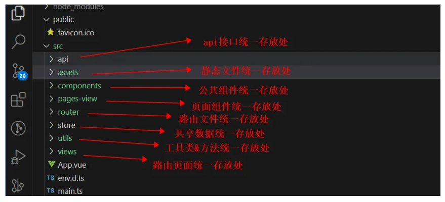
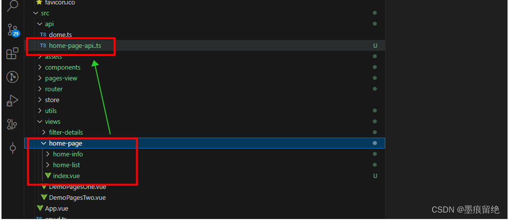
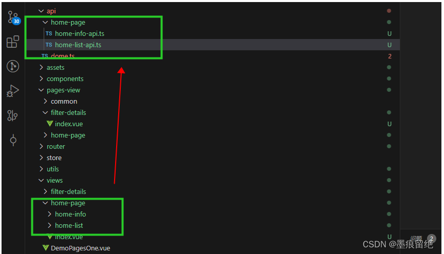
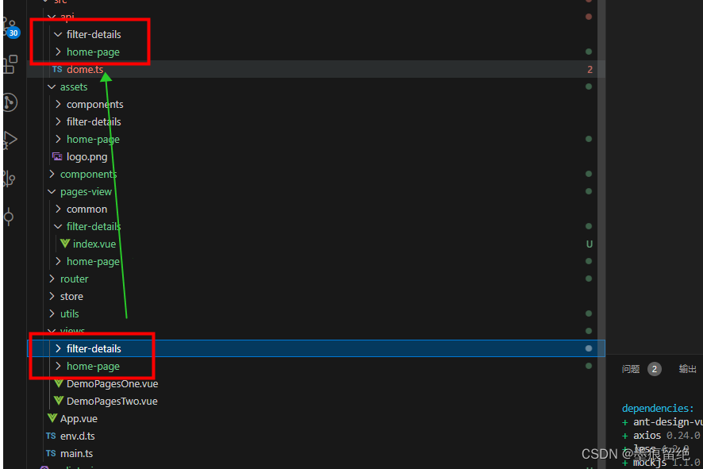
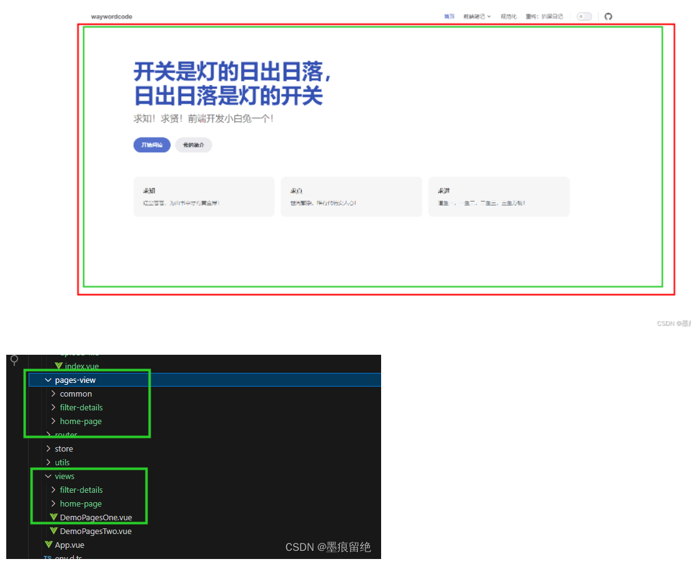
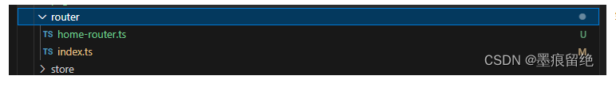
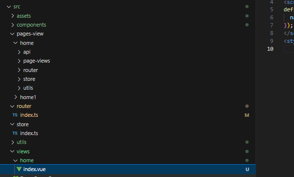

# 项目结构规范

一个好的项目结构，有利于项目的开发和维护，简单明了的结构，方便开发人员快速定位开发模块和功能模块。此处将项目结构分为两大类：功能分离结构和模块分离结构

## 功能分离结构

所谓的功能分离结构，即可为将个个功能做为一个文件夹存放，例如下图所示：

个个功能统一存放，互不影响，在每个功能文件夹下，有这些规范：

### **api 文件夹**

用于存放接口请求的文件夹，内部文件命名有两种规则

> 1.api 文件夹内不允许子文件夹的存在，文件名应该以路由名+api 作为文件名；
>
> 2.api 文件夹内可以有子文件夹，子文件夹名称应该与路由文件名同名，文件名按照其含义进行命名+api，共同接口在写在 index 文件中，而且文件夹结构应该只允许存在二级结构；

对于第一种规则，如下图所示：

页面路由 home-page 下的全部请求，应该放在 home-page-api 文件中。这种规则适合于项目接口较少的项目，一般一个页面路由全部请求不超过 20 个推荐使用这种方式。

对于第二种规则：如下图所示

在 api 文件夹内建一个与页面路由同名的文件夹，该文件夹命名规则为页面路由子路由文件夹名+api 的形式，即该子路由内的全部请求方法放到对应的 api 中的文件内。这种规则适用于路由页面请求方法比较多的情况下使用。

### **assets 文件夹**

文件夹要求：建于路由页面同名的文件，用于存放该路由下的图片资源，文件夹不可有三级结构，对于组件所需的图片资源，应该统一存放在一个统一的文件夹内。

### **components 文件夹**

用于存放公共组件，按照组件名命名文件夹，这个文件夹下的规范比较疏松，按照开发人员意愿创建即可。

### **pages-view 文件夹**

用于存放页面组件，pages 页面路由入口，pages-view 存放对应页面。具有共性的页面组件可以统一放到一个文件夹或者提到 components 文件夹。

例如下图所示：红色框表示的是首页路由，则绿色框怎就是对应的页面组件（关系为路由组件为页面组件提供出口，路由组件只做简单 props 接收和简单逻辑运算）

### **router**

用于存放路由配置，如果路由过多建议拆分路由。

### **store**

用于存放 vuex 等配置，但是项目中共享数据不建议使用 vuex 而是建议存放在缓存中或者是通过 props 先下多次传递（不推荐使用 store 共享数据）

### **utils**

用于存放工具类和工具方法，这个文件夹下规范也比较疏松，按照开发人员意愿创建文件夹和文件接口。

## 模块分离结构

模块分离结构主要是基于功能分离结构，例如下图所示：

对于 assets 和 component 文件夹，规范还功能分离结构的规范一样且没有 api 文件夹。router 和 store 只有一个 index 文件作为主文件，子文件通过引入的方式实现。utils 文件夹存放公共工具，对于路由文件夹 views 则只有路由文件且尽量不要使用子路，对于 pages-view 来说结构就和功能分离结构类似，api 则只是这个路由下的请求，pages-view 则是页面组件，router 存放改路由配置，store 同理，utils 只存放改路由写的工具。

## 总结

- 功能分离结构：适用于小项目，协作人员少的项目，结构清晰明了，维护方便，弊端是协作性比较差。
- 模块分离结构：适用于中大型项目，协作人员多的项目，开发人员只要在自己的目录下开发即可，不相互影响，提交代码不容易发生冲突，弊端就是功能分散。
- 项目结构并不是一成不变的，以上规范只是示例，在实际开发过程中可以选择其中的一个或者两者相结合，也可以在此扩展出别的项目结构。
