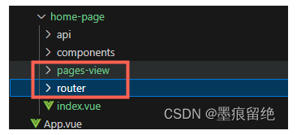
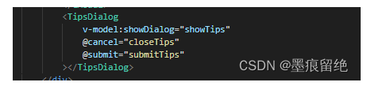

# 命名规范

## 文件和文件夹命名规范

文件和文件夹命名：全为小写字母，多单词之前用横线隔开，主要是为了适配 window 和 mac，windows 不区分大小写，mac 区分大小写。


## 变量名命名规范

- 变量&方法&计算属性：使用小驼峰命名法，其中方法末尾需要加 Fn，计算属性末尾添加 Computed。
- 类&接口：使用大驼峰命名法，其中接口末尾加 Types。
- 添加后缀主要是为了区分，可以不加。

## 组件名和组件使用规范

组件引入的组件名称使用大驼峰，带结束标签


导入组件名使用大驼峰，

```javascript
import TipsDialog from "../tips-dialog/index.vue";
```

组件名规范使用大驼峰

```javascript
defineOptions({
  name: "CompModel",
});
```

## css 类名规范

使用 BEM 命名规范。

BEM（Block，Element，Modifier）是一种基于组件的 web 开发思想。这种开发思想主张将用户界面划分为独立的块。这使得网页开发变得简单快捷，即使是复杂的用户界面，也可以重用现有的代码，而无需复制和粘贴。

**Block - 一个功能独立的页面组件，可以重用。**

- block 名称描述了此模块的用途，它是什么？
- 各个模块可以相互嵌套，嵌套层级数量不受限

例如：

```javascript
<!-- `header` block -->
<header class="header">
    <!-- Nested `logo` block -->
    <div class="logo"></div>

    <!-- Nested `search-form` block -->
    <form class="search-form"></form>
</header>
```

header 模块嵌套了 logo 模块和搜索表单模块

**Element - 块的组成模块，不能与块分开使用，也不能自己单独使用。**

- element 名称描述了在这模块中的用途，它是什么？
- element 名称的语法结构为 **block-name\_\_element-name**，使用双下划线将 block 名称和 element 名称连接起来。
- element 元素彼此之间可以相互嵌套，嵌套层级数量不受限
- 一个 element 元素里可以嵌套包含一个 block 块，这就意味着，element 名称定义不能为多层级结构，如 block**\*\*elem1**\*\*elem2 ，这种命名是不被允许的。

例如：

```javascript
<form class="search-form">
    <div class="search-form__content">
        <input class="search-form__input">

        <button class="search-form__button">Search</button>
    </div>
</form>
```

search-form**input,search-form**button,search-form\_\_content 即为 element 元素。

search-form\_\_content 元素中嵌套了 element 元素。

但是 search-form**\*\*content**\*\*input 这种多层级命名 element 元素是不被允许的，类名过长，层级结构过多，不清晰。

**Modifier - 定义 block 块或 element 元素的外观、状态或行为。**

- modifier 的名称一般描述了 block 块或 element 元素的外观，它的大小？它的状态？它的颜色
- modifier 的名称语法结构为：block-name_modifier-name；block-name\_\_element-name_modifier-name
- 一般使用单下划线将它跟 block 元素或者 element 元素连接起来；布尔形式，区分是或不是的状态，完整的语法结构为：block-name_modifier-name；block-name\_\_element-name_modifier-name

例如：

```javascript
<form class="search-form search-form_theme_islands">
    <input class="search-form__input">

    <!-- The `button` element has the `size` modifier with the value `m` -->
    <button class="search-form__button search-form__button_disabled">Search</button>
</form>
```

search-form\_\_button_disabled 这种命名结构是布尔形式。

key-value 键值对的形式，区分不同的状态。完整的语法结构则为：

- block-name_modifier-name_modifier-value
- block-name\_\_element-name_modifier-name_modifier-value

例如：

```javascript
<form class="search-form search-form_theme_islands">
    <input class="search-form__input">

    <!-- The `button` element has the `size` modifier with the value `m` -->
    <button class="search-form__button search-form__button_size_m">Search</button>
</form>
```

search-form\_\_button_size_m 这种命名结构就是键值对的形式

- modifier 不能被单独使用，必须与 block 元素或者 element 元素联合使用。因为一个 modifier 就是用来描述此元素的外观、大小、一个实体的状态。

  **BEM 的优点与缺点？**

优点

- 结构简单，一目了然
- 组件化，代码复用
- 不使用标签选择器，避免父级元素内的标签的受影响。举个例子，商品详情页是允许商家自定义标签的，那么商家展示区域标签的祖先元素，一旦用标签选择器定义了样式，子子孙孙都要背负.

例如，将这个网页拆分成 BEM 的写法

无 BEM 写法：

```javascript
<section>
    <h1>Sterling Calculator</h1>
    <form action="process.php" method="post">
        <p>Please enter an amount: (e.g. 92p, &pound;2.12)</p>
        <p>
            <input name="amount">
            <input type="submit" value="Calculate">
        </p>
    </form>
</section>
```

BEM 写法：

```javascript
<section class="widget">
    <h1 class="widget__header">Sterling Calculator</h1>
    <form class="widget__form" action="process.php" method="post">
        <p>Please enter an amount: (e.g. 92p, &pound;2.12)</p>
        <p>
            <input name="amount" class="widget__input widget__input_amount">
            <input type="submit" value="Calculate" class="widget__input widget__input_submit">
        </p>
    </form>
</section>
```

元素清单：

- widget
- widget\_\_header
- widget\_\_form
- widget\_\_input

这样就形成了一个可复用的块

注意其中的 **widget\_\_input_amount** **和** **widget\_\_input_submit**为 Modifier

缺点

- 类名变的更长，一个元素可能拥有多个 class
- id 选择器无用武之地
- class 命名不能重复
- Block 的抽象至关重要

**谁适用于 BEM**

项目复杂，复用模块较多,多人协作团队使用。
