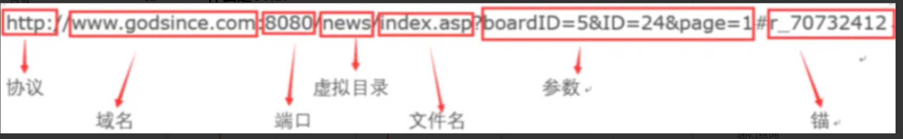
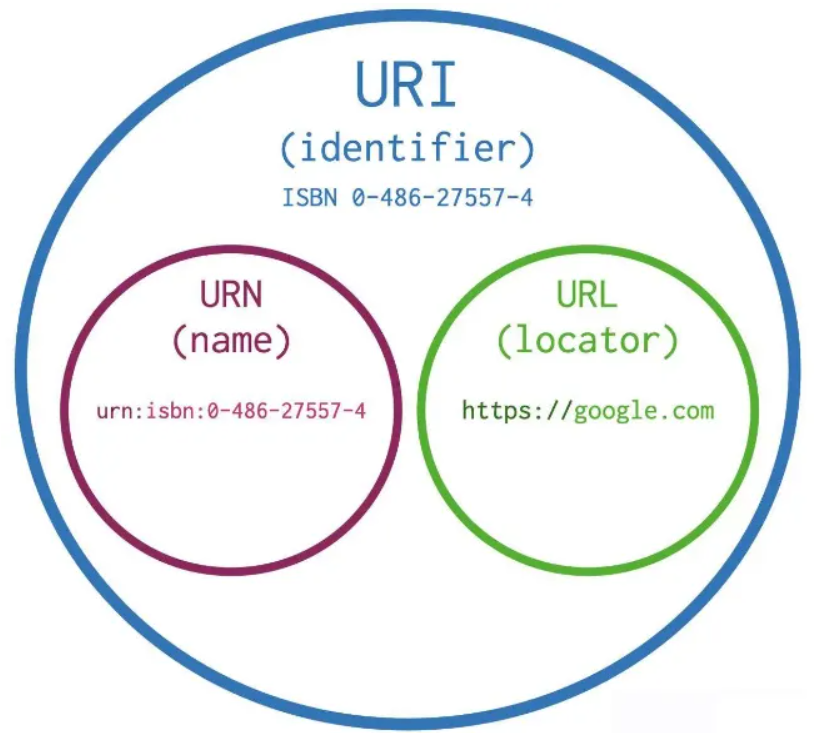

# 从输入网址（URL）到页面加载的全过程

### 解析 URL

**什么是 URL？**

在浏览器中输入 URL（也就是网址）（URL 是 Uniform Resource Locator 的缩写，即统一资源定位系统，也就是我们通常所说的网址）

**URL 由哪些部分构成？**

- 协议：一种告诉浏览器或者设备如何访问资源的方法，现在主要能见到的协议有 http，https，ftp，file 等。
- http：通过 HTTP 访问资源。格式 http://，访问 Web 服务器，请求和响应均为明文形式，不安全。
- https：通过安全的 HTTPS 访问资源。格式 https://，通过 TLS 加密，安全性高。
- ftp：通过 FTP 访问资源。格式 ftp://，下载上传文件。
- file：访问本地计算机上的资源文件。格式 file:///，注意后边是三个斜杠
- 用户名密码（旧）：username:password ，早期访问服务器的同时携带认证用户名和密码信息，因为安全度太低了已经不用了。
- 域名：表示 IP 地址的注册名称(域名)或 IP 地址，用于识别连接到网络设备的数字标识符
- 端口：跟在域名后面，不是一个 URL 必须的部分，如果省略端口会使用默认端口。
- 80 是 http 协议的默认端口，是在输入网站的时候其实浏览器（非 IE）已经帮你输入协议了，所以你输入http://baidu.com，其实是访问http://baidu.com:80。https的默认端口号是403，而8080，一般用与Web Cache，还有比如 linux 服务器里 apache 默认跑 80 端口，而 apache-tomcat 默认跑 8080 端口，其实端口没有实际意义只是一个接口，主要是看服务的监听端口。
- 路径：表示服务器上资源的路径,过去这样的路径标记的是服务器上文件的物理路径,但是现在,路径表示的只是一个抽象地址,并不指代任何物理地址.
- 参数：请求里提供的额外参数.这些参数是以键值对的形式,通过&符号分隔开来,服务器可以通过这些参数进行相应的个性化处理
- 锚：用于为页面上的标题提供快速链接，一般用来定位到某个位置，如锚点链接

### URL 和 URI、URN 的区别？

- 与 URL 相比，还有 URI(Uniform Resource Identifier) 统一资源标识符。URI 就是由某个协议方案表示的资源的定位标识符。协议方案是指访问资源所使用的协议类型名称。
- URN(Uniform Resource Name) 统一资源名称，简单来说，就是 URI 是抽象的定义，不管用什么方法表示，只要能定位一个资源，就叫 URI。
- 本来设想的的使用两种方法定位：1，URL，用地址定位；2，URN 用名称定位。

- 举个例子：去村子找个具体的人（URI），如果用地址：某村多少号房子第几间房的主人 就是 URL， 如果用身份证号+名字 去找就是 URN 了。
- 原来 uri 包括 url 和 urn，后来 urn 没流行起来，导致几乎目前所有的 uri 都是 url。
